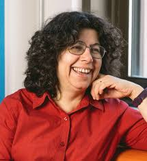

# Doina Precup

Doina Precup teaches at McGill while conducting fundamental research on reinforcement learning, working in particular on AI applications in areas that have a social impact, such as health care. She’s interested in machine decision-making in situations where uncertainty is high.

She is a senior fellow of the Canadian Institute for Advanced Research, fellow of the Association for the Advancement of Artificial Intelligence and she also heads the Montreal office of Deepmind.

Specialist In: Artificial intelligence, machine learning, reinforcement learning, reasoning and planning under uncertainty, applications.

[https://www.cs.mcgill.ca/~dprecup/](https://www.cs.mcgill.ca/~dprecup/)  
[https://mila.quebec/personne/doina-precup/](https://mila.quebec/personne/doina-precup/)  

