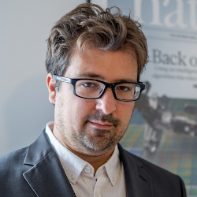

# Jean-Baptiste Mouret

 Dr. Jean-Baptiste Mouret is a senior researcher ("Directeur de recherche") at Inria, the French research institute dedicated to computer science and mathematics. From 2009 to 2015, he was an assistant professor ("maître de conférences") at the Sorbonne University (former Pierre and Marie Curie University, in Paris, France).  Overall, J.-B. Mouret conducts researches that intertwine data-efficient machine learning and evolutionary computation to make robots that can adapt in a few minutes. His work was funded by the ERC (project ResiBots), featured on the cover of Nature ("Robots that adapt like animals", Cully et al., 2015) and it received several national and international scientific awards, including the "Prix La Recherche 2016" and the "Distinguished Young Investigator in Artificial Life 2017". 

[https://members.loria.fr/JBMouret/index.html](https://members.loria.fr/JBMouret/index.html)

