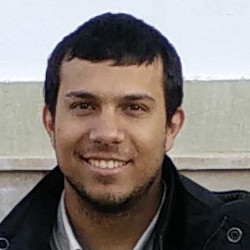

# Konstantinos Chatzilygeroudis

I am currently a Post-doctoral fellow in Machine Learning and Robotics at the [Computational Intelligence Laboratory](http://cilab.math.upatras.gr/), Department of Mathematics, University of Patras, in collaboration with [Prof. Michael N. Vrahatis](https://scholar.google.com/citations?user=3mQhqcsAAAAJ). My work focuses on using evolutionary and machine learning methods combined with simulations to develop trial-and-error methods that work on physical robots.

I am also the Leader of the R&D Computer Vision Team at [Metargus](https://www.linkedin.com/company/metargus/), a pre-seed funded start up (based in Patras, Greece), building a cutting-edge basketball coaching tool to provide coaches with insights far beyond traditional analytics. My work focuses on combining traditional Computer Vision techniques with modern Machine/Deep Learning algorithms.

I am also currently teaching the under-graduate courses "Introduction to Artificial Intelligence" and "Robotics and Intelligent Agents" at the [Computer Engineering & Informatics Department](https://www.ceid.upatras.gr/en) of University of Patras.

[http://costashatz.github.io/](http://costashatz.github.io/)
