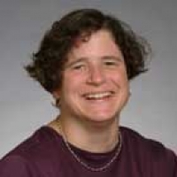

# Leslie Pack Kaelbling

Leslie is a Professor at MIT. She has an undergraduate degree in Philosophy and a PhD in Computer Science from Stanford, and was previously on the faculty at Brown University. She was the founding editor-in-chief of the Journal of Machine Learning Research. Her goal is to make robots that are as smart as you are.   She is a fellow of the AAAI.

[people.csail.mit.edu/lpk](people.csail.mit.edu/lpk)
