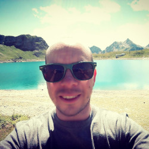

# Matteo Pirotta

I am research scientist at [Facebook AI Research](https://research.fb.com/category/facebook-ai-research/) in Paris. Previously, I was postdoc at [INRIA Lille - Nord Europe](https://www.inria.fr/en/centre/lille) in the SequeL team for almost two years. Before I was postdoc at [Politecnico di Milano](http://www.polimi.it/). I have received my PhD in computer science at Politecnico di Milano, under the supervision of [Luca Bascetta](http://bascetta.deib.polimi.it/index.php/Main_Page) and [Marcello Restelli](http://home.deib.polimi.it/restelli/MyWebSite/index.shtml).

My research interest is machine learning. In particular I am interested in reinforcement learning, transfer learning and online learning. 

[https://teopir.github.io/](https://teopir.github.io/)
