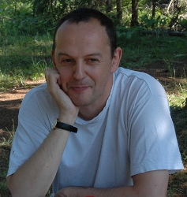

# Olivier Sigaud

## Biography

(1996) PhD in Computer Science "Learning : from control to behavior", advisor: Dominique Luzeaux (DGA)

(1995-2001) Research engineer, Departement for Advanced Studies, at DASSAULT AVIATION (Aerospace company).

(2001-2005) Lecturer in Computer Science UPMC-Paris6 (LIP6, AnimatLab)

(2002) PhD in Philosophy " Automatisme et subjectivité : l'anticipation au coeur de l'expérience", advisor: Jacques Dubucs (IHSPST)

(2004) HDR in Computer Science "Adaptive Behavior for Agents in Complex Software Settings" (in french), UPMC-Paris 6

(2005-2006) Professor in Computer Science UPMC-Paris6 (LIP6, AnimatLab)

(2007- ) Professor in Computer Science UPMC-Paris6 (ISIR, AMAC team)

## Research Activities

Understanding intelligence is a fascinating research topic. For a long time, artificial intelligence researchers have focused on typically human intellectual activities such as playing chess, having a conversation or proving theorems. But it is more and more obvious that these specific capabilities are anchored into apparently simpler capabilities such as using objects or tools, displaying social signals through the body posture or more simply moving one's body to interact appropriately with the environment.

Performing robotics research reveals the difficulty of these problems that we solve effortlessly.  Rather than addressing them through the standard engineering approach, it seems appropriate to try to figure out how our brain solves them. This amounts to investigating the psychological mechanisms through which kids acquire their motor and cognitive capabilities and neurophysiological mechanisms the brain uses to implement this learning process.

In this context, my research is focused on designing and exploiting machine learning techniques dedicated to growing motor and cognitive capabilities in robots, and to modelling these capabilities in living beings.

In practice, my work belongs to three domains:

- machine learning, where I'm interested in regression, reinforcement learning, stochastic optimisation and the combination of these methods. This domain provides the fundamental tools for the other two activities;  
- developmental robotics, which strive to endow robots with psychological mechanisms similar to those of kids;  
- computational neurosciences, which strive to design computational models of the neurophysiological mechanism of animal learning.
     

Within ISIR, I am responsible of a group about Learning for Control and Decision in Robotics (four permanent researchers)

Up to 2014, I have been in charge of the activities about learning in the [Robotics and Neuroscience](http://www.gdr-robotique.org/gt.php?id=9) group of the [french working group in Robotics](http://www.gdr-robotique.org/).

I have been the principal investigator of the [MACSi](http://macsi.isir.upmc.fr/) project (up to april 2014) based on our [iCub](http://www.robotcub.org/) humanoid robot.

I also participate to the [CODYCO](http://www.codyco.eu/) and the [DREAM](http://www.robotsthatdream.eu/) european projects.

## Teaching

A page about my teaching activities, with slides, tutorial texts and internship topics is available [here](http://pages.isir.upmc.fr/~sigaud/teach/).
