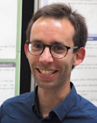

# Sebastien Gerchinovitz

I am research scientist at IRT Saint Exupéry, Toulouse, France, working in the DEEL project on machine learning theory and applications to safety-critical systems. I am also associate researcher at the Institut de Mathématiques de Toulouse, and a member of the Game Theory and Artificial Intelligence chair within the Artificial and Natural Intelligence Toulouse Institute (ANITI). Currently on leave from Université Toulouse III - Paul Sabatier where I previously held an assistant professor position. I received a PhD in Mathematics at Ecole Normale Supérieure, Paris. My main research topics are online learning, statistical learning theory, and deep learning theory. I have been in the Program Committees of ALT 2018 & 2019, ITW 2020, and COLT for several years. Research visits at University of Milan, UC Berkeley, and CWI Amsterdam.  

